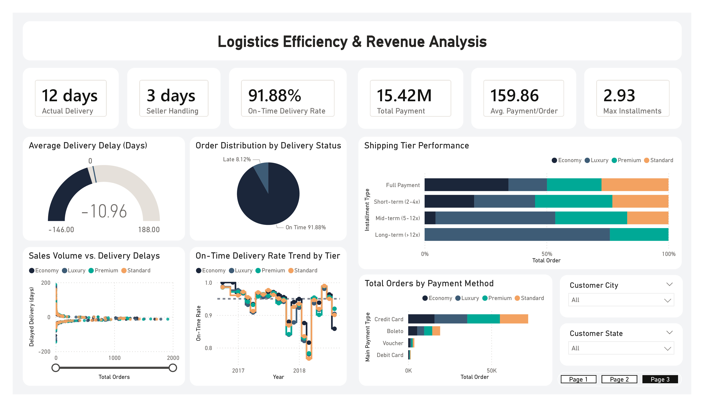

# Olist-E-commerce-Sales-Logistics-Performance-Dashboard

This project provides a comprehensive end-to-end data analytics solution for **Olist Store**, the largest department store marketplace in Brazil. The analysis transforms raw, fragmented e-commerce data into a strategic decision-making tool, focusing on revenue growth, customer segmentation (RFM), and logistics efficiency.

## Technical Workflow
The project was executed through a structured data pipeline:
1. Data Acquisition:
   - The raw dataset was obtained from www.olist.com [via Kaggle](https://www.kaggle.com/datasets/olistbr/brazilian-ecommerce), covering authentic marketplace transactions from 2016 to 2018.
2. Data Preparation (Python):
   - Performed Data Type Conversion and Handling Missing Values.
   - Conducted Data Validation to ensure consistency across relational tables.
   - Executed Data Merging and exported the cleaned datasets into a SQL environment.
3. Data Engineering (PostgreSQL):
   - Developed queries for Merging and Aggregation.
   - Structured the data into four specialized analytical tables: `data_sales`, `data_logistic`, `data_payment`, and `data_customer`.
4. Data Visualization (Power BI):
   - Imported the processed SQL tables into Power BI.
   - Developed an interactive 3-page dashboard featuring advanced visualizations such as RFM analysis and logistics performance.

## Key Dashboards & Insights
1. **Executive Sales Performance**

   - Revenue Growth: Total Revenue increased by 686.92% between September 2016 and August 2018.
   - Product Leaders: Health Beauty is the top-performing category with $1.42M in sales, followed by Watches Gifts ($1.27M).
   - Geographic Reach: Significant sales distribution across Brazil, with a heavy concentration in the Sao Paulo region.
2. **Customer Insights & Segmentation**

   - RFM Strategic Landscape: Utilized a Logarithmic Scale to map customers based on Recency (Days Since Last Purchase) and Monetary Value (Total Spent).
   - Whale Identification: Successfully isolated the "Whale" segment (Top 10%) to understand the behavior of high-value contributors.
   - Retention Alert: The current Retention Rate is 3.00%, highlighting a major opportunity for implementing customer loyalty programs.
3. **Logistics Efficiency & Revenue Analysis**

   - Delivery Excellence: The On-Time Delivery Rate stands at 91.88%.
   - Proactive Logistics: Orders are delivered an average of 10.96 days ahead of the estimated schedule, reflecting high operational efficiency.
   - Payment Behavior: Credit Card remains the preferred payment method across all customer spending tiers.
  
## Tools Used
- Languages: Python (Pandas, NumPy) for Data Cleaning.
- Database: PostgreSQL for Data Modeling and Aggregation.
- BI Tool: Power BI for Interactive Dashboarding and DAX.
